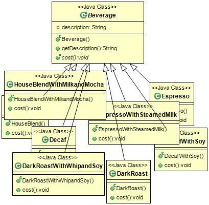
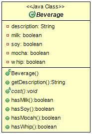
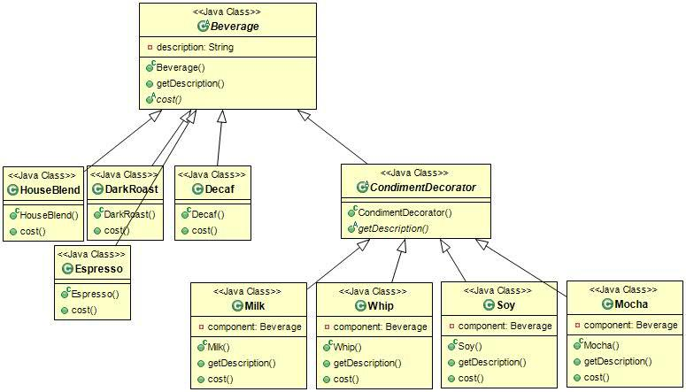
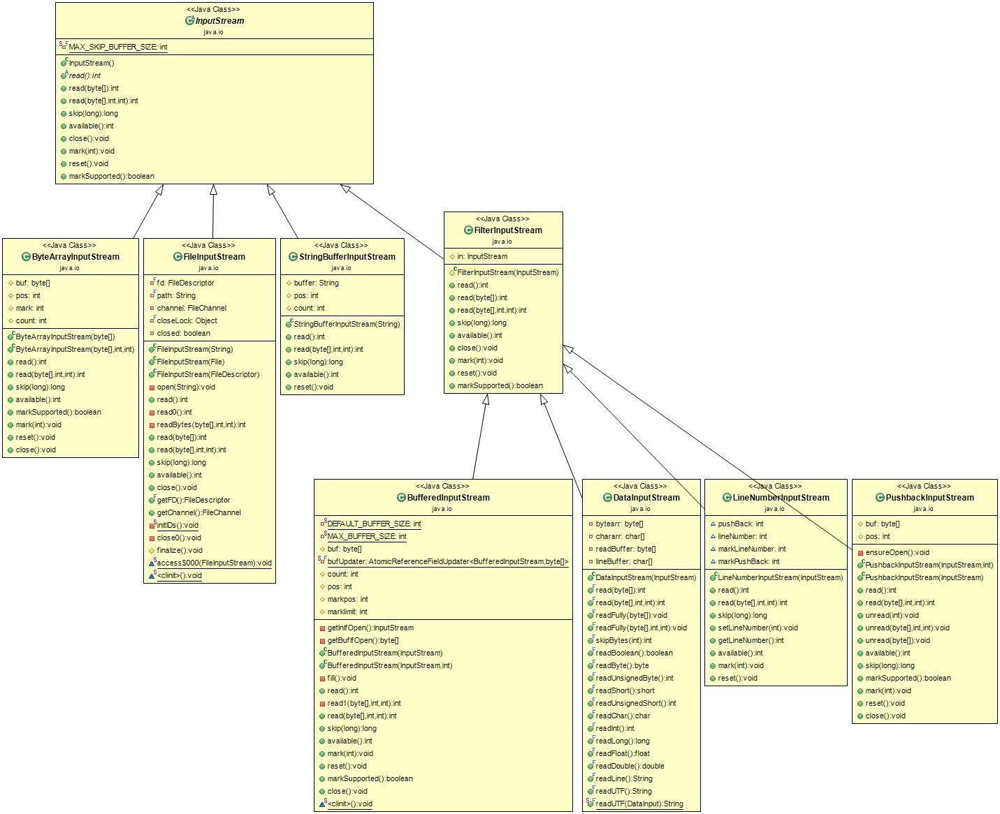

# DesignPatterns

'Head First Design Patterns' 책을 통한 공부.<br>
참고 : [예제 파일 URL](https://www.wickedlysmart.com/headfirstdesignpatterns)

## 목차
- [히스토리](#히스토리)
- [디자인 원칙](#디자인-원칙)
- [Strategy Pattern](#Strategy-Pattern)
- [Observer Pattern](#Observer-Pattern)
- [Decorator Pattern](#Decorator-Pattern)
- [Facotory Method Pattern](#Facotory-Method-Pattern)
- [Abstract Facotory Pattern](#Abstract-Facotory-Pattern)
- [용어사전](#용어사전)
## 히스토리
- 2019.12.30 : 첫 커밋.
- 2020.01.05 : 디자인 패턴 정리 1 ~ 4장
- 2020.01.19 : 팩토리 패턴 정리 및 클래스 다이어그램 작성

<div align="right"><b><a href="#">↥ back to top</a></b></div>

## 디자인 원칙
- OCP(Open-Closed Principle) : 클래스는 확장에 대해서는 열려 있어야 하지만 코드 변경에 대해서는 닫혀 있어야 한다.(124p)
- 의존성 뒤집기 원칙(Dependency Inversion Principle) : 추상된 것에 의존하도록 만들고, 클래스에는 의존하지 않도록 만든다.(177p)

<div align="right"><b><a href="#">↥ back to top</a></b></div>

## Strategy Pattern
가장 기본적인 디자인 패턴으로 알고리즘군을 정의하고 각각을 캡슐화하여 교환해서 사용할 수 있도록 한다.<br>
특징으로는 알고리즘을 사용하는 클라이언트와는 독립적으로 알고리즘을 변경할 수 있다.<br>

<div align="right"><b><a href="#">↥ back to top</a></b></div>

## Observer Pattern
한 객체의 상태가 바뀌면 그 객체에 의존하는 다른 객체들한테 연락이 가고 자동으로 내용이 갱신되는 방식으로<br>
일대다(one-to-many) 의존성을 정의한다.<br>

<div align="right"><b><a href="#">↥ back to top</a></b></div>

## Decorator Pattern
객체에 추가적인 요건을 동적으로 첨가할 수 있는 패턴이다.<br>
데코레이터는 서브클래스를 만드는 것을 통해서 기능을 유연하게 확장할 수 있는 방법을 제공한다.<br>

예시) 커피 전문점 주문 시스템
```
커피 전문점 특성
- 메뉴에 따라 휘핑, 우유 첨가 등이 달라짐.
- 토핑 종류가 추가될 수 있음.
- 손님들이 토핑을 원하는 양만큼 추가 가능함.
```
1. 첫번째 방안(메뉴 추가할 때마다 클래스 생성)



클래스가 너무 많아서 소스코드가 복잡해지고, 손님 기호에 맞는 확장이 힘들다.

2. 두번째 방안(슈퍼 클래스)



토핑의 종류가 추가될 때마다 메서드가 추가되어야한다.<br>
토핑 가격 수정 시마다 클래스 수정 필요하다.<br>
특정 토핑이 들어가면 안되는 경우도 발생한다.<br>

3. 세번째 방안(데코레이터 패턴)



토핑 종류 추가나 가격 수정이 용이해지고, 메뉴 추가도 간편해졌다.<br>

---

Java에서의 Decorator Pattern



참고 : ['jusungpark'님의 티스토리블로그](https://jusungpark.tistory.com)
<div align="right"><b><a href="#">↥ back to top</a></b></div>

## Facotory Method Pattern
객체를 생성하기 위한 인터페이스를 정의하는데, 어떤 클래스의 인스턴스를 만들지는 서브클래스에서 결정하게 만든다.<br>
즉, 팩토리 메소드 패턴을 사용하면, 클래스의 인스턴스 만드는 일은 서브클래스가 하게된다.

### 장점
1. 코드 중복의 최소화<br>
: 객체 생성코드를 전부 한 객체 또는 메소드에서 관리할 경우 중복이 최소화되며, 유지보수 시에도 한군데에만 신경쓰면 된다.
2. 유연성과 확장성<br>
: 객체 인스턴스 생성 시 구상 클래스가 아닌 인터페이스를 바탕으로 프로그래밍이 가능하다.

예시) 프렌차이즈 피자 전문점 시스템
```
프랜차이즈 피자 전문점 특성
- 주문 자체는 본점과 분점이 동일함.
- 각 분점의 피자 메뉴가 다를 수 있음.
- 같은 피자일지라도 스타일이 다를 수 있음.
```

<div align="right"><b><a href="#">↥ back to top</a></b></div>

## Abstract Facotory Pattern
인터페이스를 이용하여 서로 연관된, 또는 의존하는 객체를 구상 클래스를 지정하지 않고도 생성할 수 있게한다.

### Facotory Method Pattern / Abstract Facotory Pattern 공통점과 차이점
- 공통점
	- 애플리케이션을 특정 구현으로부터 분리시킨다.
- 차이점
	- 팩토리 메소드 패턴의 경우 객체 생성 시 상속(inheritance)을 통해, 추상 팩토리 패턴의 경우 객체 구성(composition)을 통해 생성한다.
	- 팩토리 메소드패턴의 경우 클래스를 확장하고 팩토리 메소드를 오버라이드하는 작업이 필요하다.
	- 추상 팩토리 패턴은 서로 밀접한 제품들(제품군)을 만들기 적합한 디자인 패턴이다.
	- 팩토리 메소드 패턴은 클라이언트 코드와 인스턴스를 만들어야할 구상 클래스를 분리시킬 경우 유용한 디자인 패턴이다. 

<div align="right"><b><a href="#">↥ back to top</a></b></div>

## 용어사전
- 상속(inheritance)
```
특성을 물려준다는 의미로 어떤 객체가 있을 때 그 객체의 필드(변수)와 메소드를 다른 객체가 물려받을 수 있는 기능이다.
```
- 구성(composition)
```
```
- 오버 로딩(overloading)
```
다형성을 지원하는 방법 중 하나로써, 같은 이름의 메소드를 매개변수의 유형과 갯수만 다르게하여 여러개 사용함으로 다형성을 지원한다.
```
- 오버 라이딩(overwriting)
```
다형성을 지원하는 방법 중 하나로써, 상위 클래스가 가지고 있는 메소드를 하위 클래스가 재정의함으로써 다형성을 지원한다.
```
- 슈퍼 클래스(super class)
```
상속되는 클래스, 즉 부모 클래스를 의미한다.
```
- 서브 클래스(sub class)
```
상속을 받는 클래스, 즉 자식 클래스를 의미한다.
```


<div align="right"><b><a href="#">↥ back to top</a></b></div>
